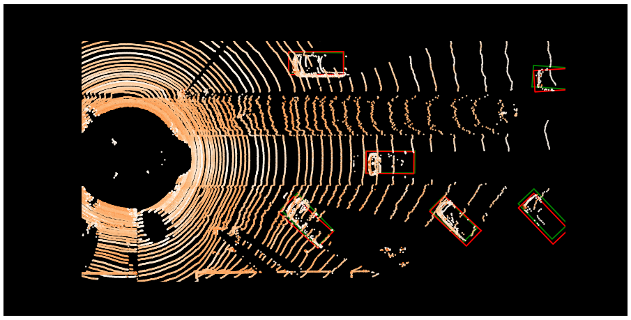
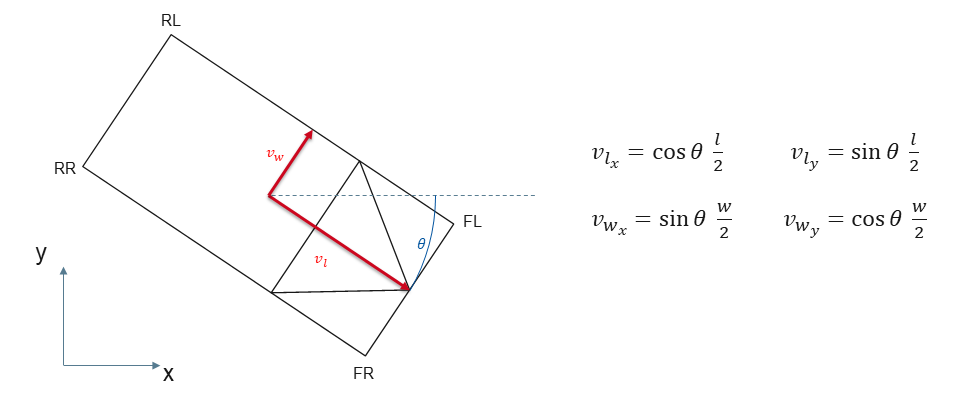

# 🚗🔍 3D Object Detection with PointPillars

This repository is a **reproducible, extensible, and educational framework** for 3D object detection and semantic segmentation projects. It builds on assignments from **RWTH Aachen University’s Institute for Automotive Engineering (ika)** as part of the
[**Automated and Connected Driving Challenges (ACDC)** MOOC](https://www.edx.org/course/automated-and-connected-driving-challenges).

The goal is to provide a **self-contained guide and toolkit** for image segmentation and object detection projects in autonomous driving — from data preprocessing and model training to experiments and literature review.

---

## 📂 Repository Structure

```
3D-object-detection/
│
├── docker/                     # Docker-related files
│   ├── Dockerfile              # Build reproducible environments
│   ├── requirements.txt        # Python dependencies
│   └── run.sh                  # Convenience script for launching container
│
├── notebooks/                  # Jupyter notebooks
│   ├── 3D Object Detection.ipynb
│   ├── assets/                 # Figures, plots, images for notebooks
│   ├── datasets/               # Datasets (e.g., KITTI samples)
│   ├── grid_mapping/           
│   ├── ipm_assets/             
│   ├── localization/           
│   ├── object_detection/       # Custom object detection code
│   ├── segmentation_utils/     
│   └── tensorflow_datasets/    
│
├── experiments/                # Saved experiments, configs, logs
│   ├── runs/                   
│   └── configs/                
│
├── literature/                 # Research papers, notes, references
│   ├── papers/                 
│   └── summaries.md            
│
├── .gitignore
├── LICENSE
└── README.md
```

> ✅ This structure is designed to evolve into a **general framework for image segmentation** using ML, with clear separation of **datasets, models, experiments, and literature**.

---

## 🚀 Getting Started

### 1. Clone the Repository

```bash
git clone https://github.com/your-username/3D-object-detection.git
cd 3D-object-detection
```

### 2. Build the Docker Container

```bash
cd docker
docker build -t 3d-object-detection .
```

### 3. Run the Container

```bash
bash docker/run.sh
```

This script will mount the repository into the container and launch JupyterLab.

### 4. Open JupyterLab

Inside the container:

```bash
jupyter lab --ip=0.0.0.0 --port=8888 --allow-root
```

Open the link shown in your terminal to access the notebooks in your browser.

---

## 📒 Notebooks Overview

### **01_data_preprocessing.ipynb**

* Prepares KITTI dataset samples.
* Explores **LiDAR point clouds and annotations**.
* Visualizes 3D bounding boxes in **2D bird’s-eye view**.
* Provides functions for **coordinate transformations** and **label projections**.

---

### **02_model_training.ipynb**

* Implements **PointPillars** for 3D object detection on KITTI.
* Inspects hyperparameters (e.g., anchors, batch sizes, loss weights).
* Prepares training and inference workflows.
* Visualizes detection results and bounding box predictions.

---

## 🛣️ Roadmap: From Object Detection to Semantic Segmentation

This repository is a **stepping stone toward full semantic segmentation** workflows. Suggested roadmap:

1. **Data Preparation**

   * Collect and preprocess raw datasets (KITTI, Waymo, nuScenes, Cityscapes).
   * Apply augmentations and dataset splits.

2. **Object Detection (Current Stage)**

   * Explore **PointPillars** for LiDAR-based 3D object detection.
   * Train and validate detection pipelines.

3. **Semantic Segmentation**

   * Introduce 2D/3D segmentation models (U-Net, DeepLab, RangeNet++).
   * Label and evaluate per-pixel classifications.

4. **Experiment Management**

   * Track experiments in `experiments/`.
   * Save configs, results, and logs systematically.

5. **Future Extensions**

   * Integrate multiple datasets.
   * Benchmark different models.
   * Add tools for visualization and deployment.

---

## 📚 References & Acknowledgements

This repository builds upon assignments from:

* **Automated and Connected Driving Challenges (ACDC)** MOOC on [edX](https://www.edx.org/course/automated-and-connected-driving-challenges)
  by [RWTH Aachen University](https://rwth-aachen.de), taught by the
  [Institute for Automotive Engineering (ika)](https://www.ika.rwth-aachen.de/).

> 👉 **Enroll for free** [here](https://www.edx.org/course/automated-and-connected-driving-challenges) to learn more about automated and connected mobility!

Additional references:

* [PointPillars: Fast Encoders for Object Detection from Point Clouds](https://arxiv.org/abs/1812.05784)
* [KITTI 3D Object Detection Benchmark](http://www.cvlibs.net/datasets/kitti/eval_object.php?obj_benchmark=3d)

---

## 🖼️ Visual Examples

<div align="center">
  
  
  <p><em>Visualization of LiDAR point clouds and 3D bounding boxes from KITTI.</em></p>
</div>

---

## 📜 License

This project is released under the **MIT License**. See [LICENSE](LICENSE) for details.
